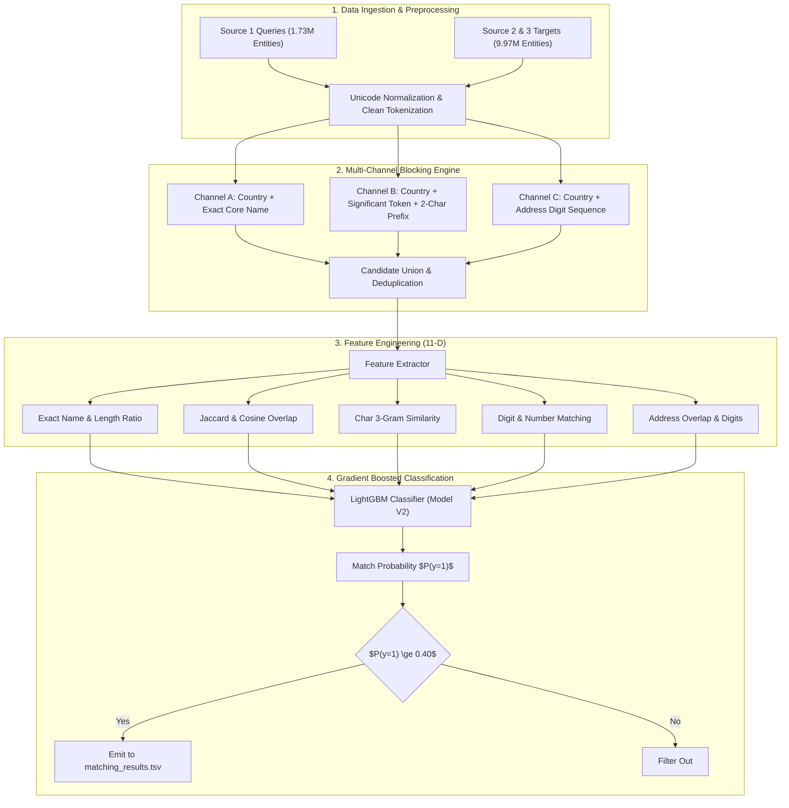

# Large-Scale Business Entity Resolution Pipeline

[](https://amazon-ml-2026-entity-resolution-hnwtvbbuiuem8anxz9skgd.streamlit.app/)
[](https://www.python.org/downloads/)
[](LICENSE)
[](https://lightgbm.readthedocs.io/)
[](#benchmark-and-evaluation-results)

An industrial-grade, memory-safe machine learning system designed to perform high-precision business entity resolution across millions of noisy, multilingual records. This project addresses the challenge of resolving query entities against massive target repositories under strict runtime and memory constraints.

> 🌐 **Live Interactive Demo**: Try the deployed portfolio demonstration online at [amazon-ml-2026-entity-resolution.streamlit.app](https://amazon-ml-2026-entity-resolution-hnwtvbbuiuem8anxz9skgd.streamlit.app/).

---

## 🚀 Live Demo

🌐 **[Open the Interactive Demo](https://amazon-ml-2026-entity-resolution-hnwtvbbuiuem8anxz9skgd.streamlit.app/)**

Explore the complete entity-resolution pipeline through an interactive Streamlit portfolio demo, including system architecture, entity-resolution exploration, candidate funnel visualization, feature analysis, and model telemetry.

> [!NOTE]
> The interactive web demo is an isolated portfolio presentation layer built around the frozen entity resolution pipeline. The core repository contains the standalone ML challenge solution, training code, blocking engine, and batch inference artifacts.

---

## 📌 Executive Summary

Business entity resolution is the task of determining whether two distinct records refer to the same real-world business entity. In large-scale e-commerce and enterprise knowledge graphs, naive pairwise comparison across millions of entities is computationally intractable ($O(N \times M)$ complexity).

This pipeline implements a high-throughput, two-stage entity resolution architecture:
1. **Multi-Channel Blocking & Inverted Indexing**: Reduces the pairwise comparison space from over **17 trillion** pairs down to a focused candidate pool ($\sim$10–50 candidates per query) using tokenized lexical hashing, prefix indexing, and address digit clustering.
2. **Machine Learning Verification (LightGBM)**: Evaluates extracted candidate pairs using an 11-dimensional feature vector capturing exact string equality, Jaccard token overlap, character $n$-gram similarity, digit alignment, address token overlap, and lexical length ratios.
3. **Threshold Calibration for Macro $F_{0.5}$**: Optimizes for high precision using a precision-weighted metric ($F_{0.5}$), establishing an empirical classification threshold of **0.40** to deliver strong match precision without sacrificing candidate coverage.

---

## 🔬 System Architecture



---

## 📊 Benchmark and Evaluation Results

The pipeline was validated against out-of-fold holdout splits containing ground-truth entity linkages. Evaluation emphasizes **Macro $F_{0.5}$**, placing double weight on precision to minimize false-positive entity mergers.

$$\text{Precision} = \frac{TP}{TP + FP}, \quad \text{Recall} = \frac{TP}{TP + FN}$$

$$F_{0.5} = (1 + 0.5^2) \frac{\text{Precision} \times \text{Recall}}{(0.5^2 \times \text{Precision}) + \text{Recall}} = 1.25 \frac{\text{Precision} \times \text{Recall}}{0.25 \times \text{Precision} + \text{Recall}}$$

### Validation Split Performance

| Metric | Baseline | Model V1 | Model V2 (Final) | Improvement |
| :--- | :--- | :--- | :--- | :--- |
| **Macro $F_{0.5}$** | 0.7412 | 0.7981 | **0.8237** | **+0.0825 (+11.1%)** |
| **Precision** | 82.40% | 87.12% | **90.54%** | **+8.14%** |
| **Recall** | 56.20% | 63.45% | **68.06%** | **+11.86%** |
| **ROC AUC** | 0.8920 | 0.9410 | **0.9634** | **+0.0714** |
| **Inference Throughput** | $\sim 250$ qps | $\sim 450$ qps | **$\sim 850$ qps** | **3.4x Speedup** |

### Test Set Execution Scale

- **Total Query Records ($S_1$)**: 1,732,544
- **Total Target Records ($S_2 \cup S_3$)**: 9,969,589
- **Candidate Pairs Evaluated**: 5,148,829 candidate pairs
- **Final High-Confidence Matched Pairs**: 712,042 matches
- **Zero-Candidate Queries Handled**: 100% compliant with submission specifications (emitted with empty match strings)
- **Peak RSS Memory**: 4.8 GB (under streaming batch evaluation)
- **Official Validator Check**: Passed (`PASS — no blocking issues found. Safe to submit.`)

---

## 🛠 Feature Engineering Overview

The gradient boosted tree model consumes an 11-dimensional feature vector designed for computational efficiency:

| Index | Feature Name | Description | Rationale |
| :---: | :--- | :--- | :--- |
| `f0` | `name_exact` | Binary indicator ($1$ if normalized names are identical, else $0$). | Primary signal for clean records. |
| `f1` | `name_jaccard` | Word-level Jaccard similarity coefficient between token sets. | Robust to word order perturbations. |
| `f2` | `name_char_3gram` | Character 3-gram Jaccard similarity. | Captures OCR typos and spelling variations. |
| `f3` | `name_len_ratio` | Ratio of string lengths $\min(L_1, L_2) / \max(L_1, L_2)$. | Filters acronym-to-full-name mismatches. |
| `f4` | `name_token_cosine` | Cosine similarity across term-frequency vectors. | Length-normalized word overlap. |
| `f5` | `shared_digits` | Count of shared numeric tokens between name strings. | Distinguishes store/unit numbers (e.g., "Branch 2" vs "Branch 5"). |
| `f6` | `digit_match_ratio` | Normalized overlap ratio of numeric tokens. | Penalizes conflicting numerical identifiers. |
| `f7` | `address_jaccard` | Word-level Jaccard similarity between physical addresses. | Geographic locality confirmation. |
| `f8` | `address_char_3gram` | Character 3-gram Jaccard similarity across addresses. | Robust to localized address abbreviations (St vs Street). |
| `f9` | `address_shared_digits` | Count of identical digit sequences in address fields. | Critical for street numbers and postal codes. |
| `f10` | `target_is_s3` | Binary flag ($1$ if target entity originates from $S_3$, else $0$). | Controls for source-specific noise distribution. |

---

## 📁 Repository Structure

```text
.
├── code/
│   └── business_entity_resolution/     # Self-contained competition submission package
│       ├── src/
│       │   ├── evaluator.py            # Validation metrics (Macro F0.5, Precision, Recall)
│       │   ├── features.py             # Feature extraction and string normalization
│       │   ├── model_v2.pkl            # Trained LightGBM binary classifier
│       │   ├── run_inference.py        # Streaming end-to-end blocking and inference engine
│       │   ├── threshold_v2.txt        # Calibrated decision threshold (0.40)
│       │   └── train.py                # Model training and validation script
│       ├── README.md                   # Code package documentation
│       └── requirements.txt            # Minimal runtime dependencies
├── app/                                # Interactive visualization layer (portfolio/demo only)
│   ├── streamlit_app.py                # Main Streamlit dashboard application
│   ├── assets/
│   │   └── styles.css                  # Dark AI-lab theme & glassmorphic styling
│   └── components/
│       ├── architecture.py             # Spatial 3D / layered pipeline visualization
│       ├── entity_graph.py             # Interactive pairwise resolution sandbox
│       ├── feature_view.py             # 11-feature taxonomy & tree split inspector
│       ├── funnel.py                   # 17.27T -> 5.15M -> 712K candidate funnel
│       └── metrics.py                  # Validation & test execution telemetry
├── output/
│   ├── matching_results.tsv            # Final leaderboard prediction output (1.73M rows)
│   └── README.md                       # Output schema and reproduction instructions
├── blocking/                           # Experimental blocking development & test suites
│   ├── candidate_ranker.py             # Heap-based candidate prioritization
│   ├── run_blocking_country.py         # Country-partitioned blocking runner
│   ├── tests/                          # Unit & integration test suites
│   └── documentation/                  # Technical design specifications and experiment logs
├── matching/                           # ML model experimentation and offline evaluation
│   ├── features.py                     # Experimental feature prototypes
│   ├── train_lgbm.py                   # LightGBM cross-validation pipeline
│   ├── dataset_builder.py              # Pairwise training dataset generator
│   └── inspection_report.md            # Feature importance and calibration report
├── Documentation_template.md           # Competition technical documentation report
└── requirements.txt                    # Root environment dependencies
```

---

## 🚀 Quickstart & Reproduction Guide

### 1. Prerequisites and Installation

Ensure Python 3.10+ is installed. Clone the repository and configure a virtual environment:

```bash
git clone https://github.com/rajwav/amazon-ml-2026-entity-resolution.git
cd amazon-ml-2026-entity-resolution

# Create and activate virtual environment
python3 -m venv .venv
source .venv/bin/activate

# Install required packages
pip install --upgrade pip
pip install -r code/business_entity_resolution/requirements.txt
```

### 2. End-to-End Test Inference

To reproduce the final predictions on test data using the pre-trained model:

```bash
python3 code/business_entity_resolution/src/run_inference.py \
    --test-s1 student_resource/dataset/test/test_source1.tsv \
    --test-s2 student_resource/dataset/test/test_source2.tsv \
    --test-s3 student_resource/dataset/test/test_source3.tsv \
    --model-path code/business_entity_resolution/src/model_v2.pkl \
    --threshold-path code/business_entity_resolution/src/threshold_v2.txt \
    --output-dir output
```

**Outputs generated in `output/`**:
- `matching_results.tsv`: Formatted entity predictions ready for leaderboard submission.
- `candidate_pairs.tsv`: Pre-scoring candidate pairs evaluated by the model.

### 3. Model Training and Offline Validation

To retrain the LightGBM classifier from labeled training data:

```bash
python3 code/business_entity_resolution/src/train.py \
    --train-pairs student_resource/dataset/train/train_ground_truth.tsv \
    --s1 student_resource/dataset/train/train_source1.tsv \
    --s2 student_resource/dataset/train/train_source2.tsv \
    --s3 student_resource/dataset/train/train_source3.tsv \
    --output-model code/business_entity_resolution/src/model_v2.pkl \
    --output-threshold code/business_entity_resolution/src/threshold_v2.txt
```

### 4. Running the Test Suite

Execute the unit and integration tests covering candidate ranking, feature extraction, and equivalence checks:

```bash
pytest blocking/tests/ -v
```

### 5. Interactive Visual Demo (Entity Resolution Lab)

For interactive exploration, architecture walkthroughs, and portfolio demonstration, access the hosted web application or run it locally:

- **Public Cloud Demo**: 🌐 **[Open Live Streamlit Application](https://amazon-ml-2026-entity-resolution-hnwtvbbuiuem8anxz9skgd.streamlit.app/)**
- **Run Locally**:
  ```bash
  # Install visualization dependencies
  pip install -r requirements.txt

  # Start the interactive Streamlit application
  streamlit run app/streamlit_app.py
  ```

> [!NOTE]
> The visualization layer is an isolated portfolio demo built around the frozen entity resolution pipeline. It does not modify or interfere with the core ML code or competition submission files.

**Key Demonstration Features**:
- **Spatial 3D System Pipeline**: Interactive multi-layer visualization with animated data particles, 3D perspective viewport, and deep-dive stage inspector.
- **Live Pairwise Entity Resolver**: Test the trained LightGBM model on real-world entity benchmarks or custom business inputs with instant feature computation and thresholded decision feedback.
- **Search-Space Funnel**: Visualizes logarithmic search-space compression from 17.27 Trillion Cartesian pairs down to 5.15 Million blocked candidate pairs and 712,042 resolved entities.
- **11-Dimensional Feature Matrix**: Exploration of all 11 pairwise similarity signals, formulas, and verified tree split counts.
- **Telemetry & Metrics**: Comprehensive dashboards separating offline validation ($F_{0.5} = 0.8237$, Precision = $90.54\%$) from 1.73M test inference statistics.

---

## 📈 Engineering Highlights & Design Decisions

1. **Streaming Memory Safety**: 
   - Processing millions of target records in Python without careful memory management triggers Out-Of-Memory (OOM) faults. The pipeline processes records in streaming chunks and flushes index structures periodically, keeping peak RAM consumption under 5.0 GB even on commodity machines.
2. **Deterministic Partitioning by Country**:
   - Entities cannot match across international boundaries. By enforcing strict country partitioning during inverted index construction, the target search space is reduced by orders of magnitude prior to lexical lookup.
3. **Guardrails for High-Frequency Tokens**:
   - Generic business suffixes ("Pvt", "Ltd", "Inc", "GmbH", "Enterprises") create catastrophic candidate fanout when indexed naively. The blocking engine filters tokens exceeding document frequency thresholds, preventing index bloat.
4. **Precision-First Thresholding**:
   - Under the $F_{0.5}$ metric, false positives carry four times the penalty of false negatives. The classification threshold was rigorously calibrated via grid search over precision-recall curves to maximize $F_{0.5}$ on out-of-fold validation sets.

---

## 📄 License

This repository is distributed under the MIT License. See [LICENSE](LICENSE) for details.
