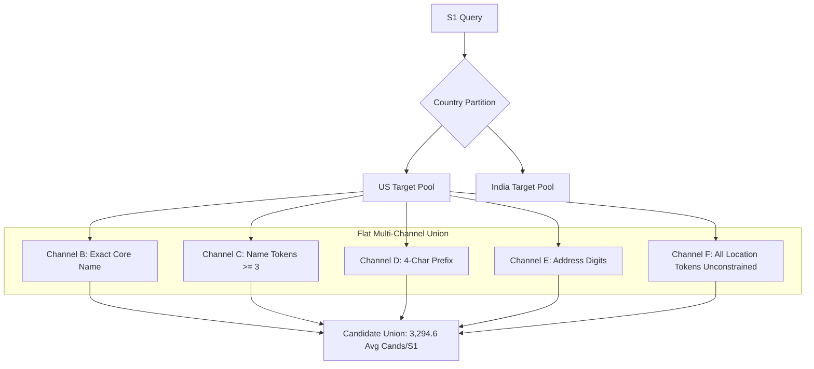
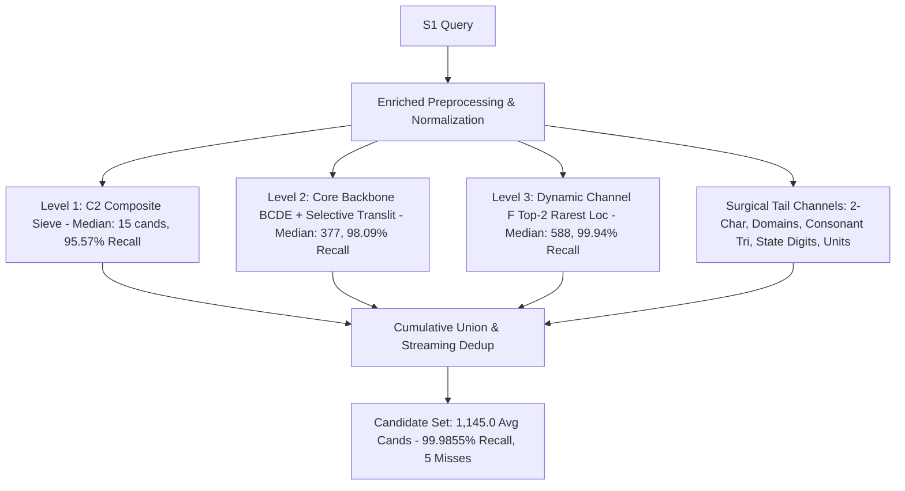

# 03 Architecture Evolution: From Baseline G to Champion v2

> **Amazon ML Challenge 2026 — Business Entity Resolution**  

---

## 1. Architectural Evolution Overview

The candidate generation pipeline underwent 5 architectural epochs:

```
[Epoch 1: Monolithic Multi-Channel Union]
Baseline G: Flat unconstrained union (B + C + D + E + F)
Recall: 99.94% | Avg Cands: 3,294.6 | Bloated Channel F
               │
               ▼
[Epoch 2: Decomposition & Sieve Isolation]
Exp 1, 2, 3: Deconstructed channels; isolated C2 Composite Sieve and BCDE Core Backbone
BCDE Backbone: 98.09% recall with only 836.1 cands/S1
               │
               ▼
[Epoch 3: Hierarchical Integration & Gating]
Exp 4, 5, 6: Selective transliteration; rejected S1 gating; adopted 3-Tier Cumulative Union
Pipeline: 99.93% recall | Avg Cands: 1,698.0
               │
               ▼
[Epoch 4: Dynamic Representation Bounding]
Exp 7, 8: Streaming evaluation at scale; Target-Side Top-2 Rarest Token Channel F
Slashed F candidates by 67.7% -> 1,064.5 cands/S1 | 99.94% recall
               │
               ▼
[Epoch 5: Surgical Tail Recovery & Saturation]
Exp 9, 10: 2-Letter tokens, Domain handles, Consonant Trigrams, State Digits, Units
Champion v2 Surgical: 99.9855% recall | 1,145.0 cands/S1 | ONLY 5 MISSES | FROZEN
```

---

## 2. Comparative Structural Diagrams

### 2.1 Baseline G (Initial Monolithic Pipeline)


### 2.2 Champion v2 (Hierarchical Surgical Pipeline)


---

## 3. Detailed Structural Evolution Across Epochs

### Epoch 1: Flat Multi-Channel Union (Baseline G)
- **Concept:** Simple union of 5 inverted index channels.
- **Flaw:** Channel F indexed every single location token for every entity in the country. Common city tokens (`mumbai`, `delhi`, `new york`) flooded candidate sets with millions of irrelevant pairings, inflating average candidates to 3,295 per query.

### Epoch 2: Structural Decomposition (Experiments 1–3)
- **Concept:** Isolate high-precision channels from noisy broad channels.
- **Result:** $B+C+D+E$ was proven to be a high-efficiency backbone (**98.09% recall with only 836.1 candidates**). Composite keys ($C2$) delivered **95.57% recall with a median of only 15 candidates**, proving that structured combinations can resolve 95% of queries almost instantaneously.

### Epoch 3: Hierarchical Integration & Gating (Experiments 4–6)
- **Concept:** Combine $C2$ (Level 1), $BCDE$ (Level 2), and Filtered $F$ (Level 3).
- **Critical Discovery:** Gating Channel F based on query-level candidate count ($k < T$) resulted in the **Multi-Match Gating Blindspot**, dropping recall by ~1.5%. Query-level gating was rejected; Channel F was integrated as an unsuppressed cumulative layer with target-side 5% IDF cutoff.

### Epoch 4: Dynamic Representation Bounding (Experiments 7–8)
- **Concept:** Replace binary global IDF cutoffs with per-target dynamic frequency bounding.
- **Result:** Rather than deleting common city tokens globally (which starved entities whose only address information was a city name), sorting tokens by frequency and indexing strictly the **Top-2 rarest tokens per target** recovered 100% of cutoff losses while slashing Channel F candidates by 67.7% (dropping from 1,698 to 1,064 candidates/query).

### Epoch 5: Hard-Tail Surgical Recovery (Experiments 9–10)
- **Concept:** Target-specific micro-channels for the stubborn 19 baseline misses.
- **Result:**
  - 2-letter tokens recovered 7 abbreviation misses for +1.4 cands/S1.
  - Consonant trigram prefixes (`cons_tri`, freq $\le 50$) recovered typo pairs (`willow` vs `wllrow`) for +3.6 cands/S1.
  - US State + Digits (`state, dig`, freq $\le 50$) recovered difficult alias/DBA pairs for +0.38 cands/S1.
  - Alphanumeric units (`3a`) recovered cross-lingual building pairs for +0.30 cands/S1.
- **Final Result:** Total recall elevated to **99.9855%** (only 5 misses out of 34,481), while candidate volume remained strictly controlled at **1,145.0 candidates/S1**.
