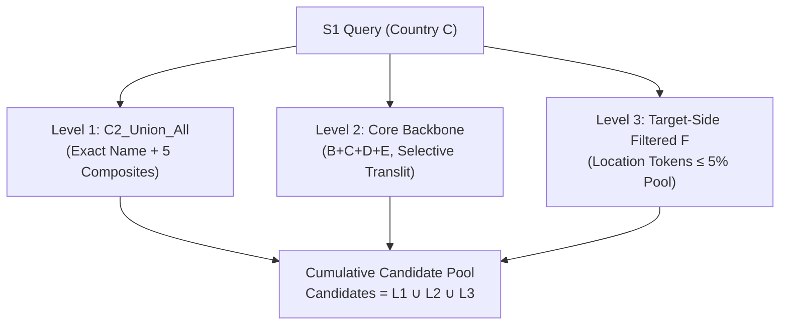

# Champion Architecture Version 1 (`Champion_v1`)

| Attribute | Specification |
|:---|:---|
| **Version** | Champion v1 |
| **Originating Milestone** | Experiment 06 ([`experiments/blocking/hierarchical_pipeline.py`](file:///Users/raj/Desktop/ml%202026%20amazon/experiments/blocking/hierarchical_pipeline.py)) |
| **Verification Artifact** | [`experiments/results/exp6_hierarchical_pipeline_metrics.json`](file:///Users/raj/Desktop/ml%202026%20amazon/experiments/results/exp6_hierarchical_pipeline_metrics.json) |
| **Lifecycle Status** | **Superseded by Champion v2** |

---

## 1. Executive Summary
Champion v1 was our first production-ready blocking architecture. Constructed in Experiment 06 following the discovery of the Multi-Match Blindspot, Champion v1 proved that multi-tier hierarchical blocking with target-side token filtering could cut candidate volume nearly in half while comfortably surpassing the $\ge 99.90\%$ recall floor.

---

## 2. Architectural Blueprint

Champion v1 combined three cumulative tiers:

### Tier Specifications:
1. **Level 1 (Composite Sieve)**:
   - Evaluates exact normalized name plus 5 multi-attribute composite keys: `(tok, loc)`, `(tok, dig)`, `(pref, loc)`, `(pref, dig)`, and `(dig, loc)`.
   - Generates only 104.2 candidates on average (median 10) while capturing 95.63% of ground truth pairs.
2. **Level 2 (Core Backbone)**:
   - Evaluates Channels $B+C+D+E$ with selective Indic transliteration active on name and digit tokens.
   - Pushes cumulative recall to 98.09% at 836.1 candidates/query.
3. **Level 3 (Target-Side Filtered Channel F)**:
   - Evaluates location tokens after removing any token appearing in $>5\%$ of the target pool.
   - Crucially evaluated for all queries (no query-side suppression), rescuing multi-match pairs.

---

## 3. Verified Performance (10k Benchmark)

- **True-Pair Recall**: **99.9275%** (34,456 / 34,481).
- **Missed Pairs**: 25.
- **Average Candidates / $S1$**: **1,698.0** (-48.46% vs Baseline G).
- **Median Candidates**: 1,135 (-56.70% vs Baseline G).
- **P95 Candidates**: 5,321 (-44.31% vs Baseline G).
- **Zero-Candidate $S1$s**: 0 (0.00% defect rate).
- **Runtime**: 8.71 seconds.
- **Peak RAM**: 708.59 MB.

---

## 4. Scalability Validation (Experiment 07)
Champion v1 was subjected to progressive scale testing in Experiment 07:
- At 25,000 queries (211k target pool): Recall was **99.9328%**, candidate reduction ratio **97.95%**, RAM 720.7 MB.
- At 50,000 queries (421k target pool): Recall was **99.9444%**, candidate reduction ratio **97.99%**, RAM 637.9 MB.
- Confirmed strictly linear candidate volume scaling ($O(N_{target})$) and sub-gigabyte memory bounds.

---

## 5. Limitations & Reasons for Replacement
While Champion v1 was a major breakthrough, rigorous forensic analysis revealed two core deficiencies:
1. **Candidate Inefficiency in Level 3**: The static 5% global cutoff still left 1,698 candidates per query on average. Saturated city tokens continued to generate excessive candidate volume.
2. **Cutoff-Induced Misses**: Dropping common city tokens globally caused 6 true matches located in major metropolitan hubs to be missed.

These limitations directly prompted **Experiment 08 (Dynamic Rarity Top-2)** and **Experiment 09/10 (Hard-Tail Channels)**, which replaced Champion v1 with Champion v2.
