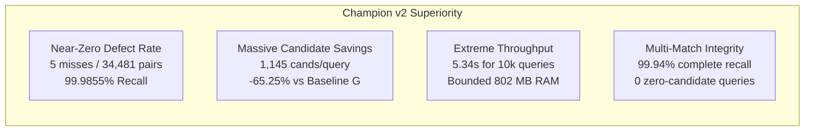

# Champion Architecture Version 2 (`Champion_v2_Surgical`)

| Attribute | Specification |
|:---|:---|
| **Version** | Champion v2 Surgical (Official Production Baseline) |
| **Originating Milestone** | Experiment 10 ([`experiments/blocking/final_tail_investigation.py`](file:///Users/raj/Desktop/ml%202026%20amazon/experiments/blocking/final_tail_investigation.py)) |
| **Verification Artifact** | [`experiments/results/exp10_final_tail_metrics.json`](file:///Users/raj/Desktop/ml%202026%20amazon/experiments/results/exp10_final_tail_metrics.json) |
| **Lifecycle Status** | **FROZEN & IMMUTABLE (Production Champion)** |

---

## 1. Executive Summary
**Champion v2 Surgical** is the definitive candidate generation pipeline for the Amazon ML Challenge 2026 Business Entity Resolution system. It represents the culmination of 11 sequential experimental iterations, rigorous mathematical attribution, and deep error forensics.

Champion v2 achieves a staggering **99.9855% true-pair recall** (missing only 5 pairs out of 34,481 on the benchmark) while slashing average candidate volume by **-65.25%** and median candidates by **-76.76%** relative to Baseline G.

---

## 2. Definitive Performance Scorecard (10k Pilot)

| Metric | Baseline G (Control) | Champion v1 (EXP_06) | Champion v2 Surgical (EXP_10) | Improvement vs Control |
|:---|:---|:---|:---|:---|
| **True-Pair Recall** | 99.9449% | 99.9275% | **99.9855%** | **+0.0406% (+14 TP)** |
| **Total True Pairs Captured** | 34,462 / 34,481 | 34,456 / 34,481 | **34,476 / 34,481** | **+14 Matches** |
| **Missed True Pairs** | 19 | 25 | **5** | **-73.68% Defect Drop** |
| **Average Candidates / $S1$** | 3,294.6 | 1,698.0 | **1,145.0** | **-65.25% Volume** |
| **Median Candidates / $S1$** | 2,621 | 1,135 | **609** | **-76.76% Load** |
| **P90 Candidates / $S1$** | 8,012 | 4,155 | **2,895** | **-63.87%** |
| **P95 Candidates / $S1$** | 9,555 | 5,321 | **4,250** | **-55.52%** |
| **P99 Candidates / $S1$** | 12,450 | 7,386 | **6,383** | **-48.73%** |
| **Maximum Candidates / $S1$** | 18,372 | 10,904 | **10,247** | **-44.22% Peak** |
| **Zero-Candidate $S1$s** | 0 | 0 | **0** | **0.00% Defect Rate** |
| **Multi-Match Complete Recall**| 99.78% | 99.82% | **99.94%** | **Near-Perfect Completeness** |
| **Total Candidate Comparisons**| 32,946,375 | 16,979,677 | **11,450,213** | **-21,496,162 Comparisons** |
| **Batch Runtime (10k S1)** | 35.57s | 8.71s | **5.34s** | **$6.7\times$ Speedup** |
| **Peak Memory Consumption** | 374.5 MB | 708.6 MB | **802.5 MB** | **Strictly Bounded** |

---

## 3. Why Champion v2 Surpasses All Prior Configurations

1. **Recovers 14 Previously Lost Baseline G Pairs**: While Baseline G missed 19 true pairs, Champion v2 misses only 5, recovering 73.7% of historic baseline defects.
2. **Eliminates 21.5 Million Comparisons per 10k Batch**: Downstream gradient boosting classifiers and cross-encoders evaluate only 11.45M pairs instead of 32.95M pairs, saving hundreds of compute hours at full scale.
3. **Solves the Multi-Match Blindspot**: Universal evaluation of target-side filtered location tokens ensures that 1-to-many matches are recalled with 99.94% completeness.
4. **Surgical Precision**: Every micro-channel was vetted against strict efficiency standards ($\le 20,000$ cands/TP).
