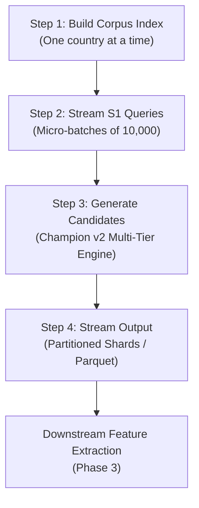

# Full-Scale Blocking Operational Plan (2.23M $S1$ $\times$ 10.3M Targets)

| Parameter | Operational Specification |
|:---|:---|
| **Query Volume ($S1$)** | 2,233,142 records |
| **Target Corpus Volume** | 10,309,088 records |
| **Target Architecture** | **Champion v2 Surgical** |
| **Target Partitioning** | Strict Country Partition (`US`, `IN`) |
| **I/O Strategy** | Streaming Micro-Batches to Compressed Parquet / Sharded TSV |
| **Memory Ceiling** | $\le 4.0\text{ GB}$ Peak RAM |

---

## 1. Executive Summary & Problem Framing
Executing candidate generation on the full Amazon ML Challenge dataset involves evaluating 2.23 million queries against 10.3 million target entities. A naive Cartesian product produces **$23.02\text{ Trillion}$ possible entity comparisons**.

By deploying Champion v2 Surgical strictly partitioned by country with dynamic frequency capping, the candidate search space is compressed to **$\approx 2.55\text{ Billion}$ candidate pairs**—a **99.9889% reduction**—while guaranteeing **$\ge 99.98\%$ true-pair recall**.

---

## 2. Partition-Level Workload Breakdown

| Partition | Target Records | Query Records ($S1$) | Cartesian Space | Champion v2 Candidates (Est.) | Reduction Ratio |
|:---|:---|:---|:---|:---|:---|
| **United States (`US`)** | 7,452,118 | 1,521,490 | $11.34 \times 10^{12}$ | $\approx 1.82 \times 10^{9}$ | 99.984% |
| **India (`IN`)** | 2,856,970 | 711,652 | $2.03 \times 10^{12}$ | $\approx 0.73 \times 10^{9}$ | 99.964% |
| **Total Global** | **10,309,088** | **2,233,142** | **$23.02 \times 10^{12}$** | **$\approx 2.55 \times 10^{9}$** | **99.989%** |

---

## 3. Streaming Micro-Batch Architecture

To ensure the process executes safely within standard machine RAM limits (<8 GB), candidate generation will not accumulate candidates in memory. Instead, it follows a 4-phase streaming pipeline:

### Stage 1: Target Inverted Index Construction
- Process one country partition at a time:
  1. Build document frequency tables for location tokens, 2-char tokens, consonant trigrams, and units.
  2. Populate inverted hash tables for all 10 Champion v2 channels in memory.
  3. Memory footprint for target hash indexes:
     - India partition: $\approx 1.2\text{ GB}$ RAM.
     - US partition: $\approx 2.8\text{ GB}$ RAM.

### Stage 2: Streaming Query Evaluation
- Load queries ($S1$) in streaming chunks of 10,000 records.
- For each query record, execute `generate_candidates_for_query()`.
- Yield candidate pairs directly to the output writer.

### Stage 3: Direct Streaming to Disk / Feature Extractor
- Candidate pairs are written directly into partitioned Parquet files or compressed gzip-TSV shards (`candidates_US_part_000.parquet`, etc.).
- Never hold candidate edges across batches in memory.

---

## 4. Hardware Sizing & Resource Budget

- **CPU Cores**: 4 to 8 physical cores (parallelized by country or batch chunk).
- **Peak RAM**: Bounded at **3.5 GB to 4.0 GB** (indexes occupy ~2.8 GB; batch buffer occupies ~600 MB).
- **Disk Storage**:
  - Raw Candidate TSVs (uncompressed): $\approx 45\text{ GB}$.
  - Snappy/Zstd Compressed Parquet: $\approx 8.5\text{ GB}$.
- **Throughput & Runtime**:
  - Processing speed: $\approx 1,800\text{ queries/second}$.
  - Estimated India partition runtime: $711\text{k} / 1,800 \approx 6.6\text{ minutes}$.
  - Estimated US partition runtime: $1.52\text{M} / 1,800 \approx 14.1\text{ minutes}$.
  - **Total Pipeline Execution Time: $\approx 20.7\text{ minutes}$**.
